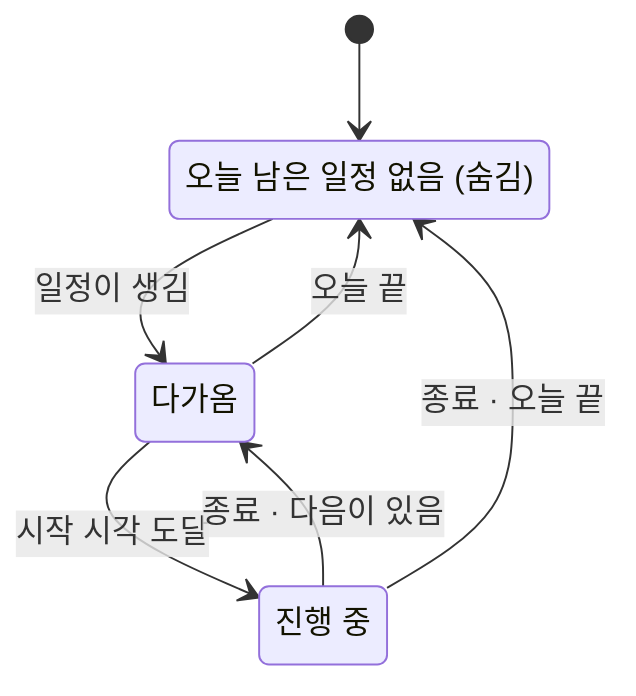

# WHENCALENDAR — 기술 스펙과 결정 기록

> 프로젝트 정의는 [01_프로젝트.md](01_프로젝트.md), 요구사항 ID는 [02_요구사항.md](02_요구사항.md). 2026-09-17 v0.1.

## 1. 스택 (WHENWORK·WHENNOTE와 동일)

| | |
|---|---|
| 런타임 | Electron 43.x · Node 22+ |
| 렌더러 | vanilla JS + CSS. 프레임워크 없음 ([D-01](#d-01-스택은-whenworkwhennote-계열)) |
| 저장소 | `node:sqlite` 단일 파일 (`store.sqlite`) |
| 글꼴 | 번들한 Pretendard Variable |
| 빌드 | electron-builder → Windows NSIS |
| 배포 | GitHub Releases, 미서명, electron-updater |
| 테스트 | `node:test` + 창 없는 스모크 + 강제 종료 스모크 |

### 식별자

| | |
|---|---|
| `app.setName` | `whencalendar` |
| 데이터 폴더 | `%APPDATA%\whencalendar` |
| 저장소 파일 | `store.sqlite` |
| 전역 단축키 | 창 `Ctrl+Alt+C` ([오픈이슈 #2](#오픈이슈)) |
| 단일 인스턴스 락 | `whencalendar` |

형제 앱과 이름·폴더·락이 전부 다르므로 네 앱이 한 PC에서 동시에 돈다 (PLAT-05).

## 2. 모듈 구조

```
main/
  index.mjs        앱 부트, 단일 인스턴스
  lifecycle.mjs    창 생성·트레이·자동시작
  overlay.mjs      오버레이 창과 상태 브로드캐스트   ← 이 앱 고유
  clock.mjs        틱 · 상태 계산 · 절전 복귀 보정   ← 이 앱 고유
  sync.mjs         .ics 가져오기·파싱·반영
  recur.mjs        RRULE 펼치기
  store.mjs        SQLite 접근
  ipc.mjs          채널 정의
  settings.mjs     설정
  place.mjs        창 위치 기억 (WHENWORK 승계)
  update.mjs       자동 업데이트 (WHENWORK 승계)
  platform/        OS 분기는 여기 안에만 (PLAT-06)
renderer/
  tokens.css       디자인 토큰 (형제 앱과 같은 팔레트 + --live, --cal-1..6)
  overlay.html/js  아일랜드
  main.html/js     오늘·주·월·구독·설정
  view.js icons.js 공용
```

## 3. 데이터 흐름

```
.ics URL ──sync.mjs──▶ event 테이블 ──┐
                                      ├──▶ clock.mjs ──▶ overlay (1초 틱)
직접 등록 ──ipc──▶ event 테이블 ──────┘                └──▶ main 창 (변경 시)
```

핵심은 **`clock.mjs`가 단일 진실**이라는 것이다. 오버레이와 본체 창이 각자 시각을 계산하면 둘이 어긋난다. 상태 계산은 한 곳에서 하고 결과를 뿌린다.

## 4. 데이터 모델 (v1 스키마)

```sql
CREATE TABLE calendar (
  id            INTEGER PRIMARY KEY,
  kind          TEXT    NOT NULL,           -- 'subscription' | 'local'
  name          TEXT    NOT NULL,
  url           TEXT,                       -- subscription만
  color         INTEGER NOT NULL,           -- 1..6 → --cal-N
  enabled       INTEGER NOT NULL DEFAULT 1,
  last_sync_at  TEXT,
  last_error    TEXT,                       -- 실패 사유. 성공하면 NULL
  etag          TEXT,                       -- 조건부 요청용
  created_at    TEXT    NOT NULL
);

CREATE TABLE event (
  id            INTEGER PRIMARY KEY,
  calendar_id   INTEGER NOT NULL REFERENCES calendar(id),
  uid           TEXT,                       -- .ics UID. 구독은 필수
  title         TEXT    NOT NULL,
  starts_at     TEXT    NOT NULL,           -- ISO8601
  ends_at       TEXT,
  all_day       INTEGER NOT NULL DEFAULT 0,
  tzid          TEXT,                       -- .ics TZID 원문
  rrule         TEXT,                       -- RFC 5545 원문 그대로 (D-07)
  exdates       TEXT,                       -- JSON 배열
  location      TEXT,
  note          TEXT,                       -- 한 줄. 에디터 없음
  remind_min    INTEGER,
  source_hash   TEXT,                       -- 구독 갱신 시 변경 감지
  deleted_at    TEXT,                       -- 소프트 삭제 (EV-06)
  created_at    TEXT    NOT NULL,
  updated_at    TEXT    NOT NULL
);
CREATE UNIQUE INDEX ux_event_uid ON event(calendar_id, uid) WHERE uid IS NOT NULL;
CREATE INDEX ix_event_starts ON event(starts_at) WHERE deleted_at IS NULL;

-- 반복 일정의 "이 하나만" 수정·취소
CREATE TABLE override (
  id             INTEGER PRIMARY KEY,
  event_id       INTEGER NOT NULL REFERENCES event(id),
  recurrence_id  TEXT    NOT NULL,          -- 원래 시작 시각
  starts_at      TEXT, ends_at TEXT, title TEXT,
  cancelled      INTEGER NOT NULL DEFAULT 0
);
CREATE UNIQUE INDEX ux_override ON override(event_id, recurrence_id);

CREATE TABLE setting (key TEXT PRIMARY KEY, value TEXT NOT NULL);
```

**반복은 펼쳐서 저장하지 않는다.** RRULE 원문을 그대로 두고 조회할 때 `recur.mjs`가 창(window) 범위만 펼친다 — 오늘·이번 주·이번 달처럼 범위가 늘 좁고, 미리 펼쳐 두면 `.ics`가 바뀔 때마다 지우고 다시 만들어야 한다 ([오픈이슈 #4](#오픈이슈)에서 성능 재검토).

## 5. 오버레이 상태 기계

이 앱의 심장이다. `clock.mjs`가 1초마다 현재 시각으로 상태를 계산해 브로드캐스트한다.



`upcoming`은 남은 시간에 따라 다섯 단계로 나뉜다 (OVL-05).

| 남은 시간 | 단계 | 펼침 | 색 | 기타 |
|---|---|---|---|---|
| > 60분 | 잠잠 | 0 | 청록 옅게 | 링만 |
| 60 ~ 30분 | 옅음 | 0 | 옅은 파랑 | |
| 30 ~ 10분 | 인지 | 0 → 1 선형 | 파랑 → 호박 | 이름·남은 시간이 흘러나옴 |
| 10 ~ 5분 | 주의 | 1 | 호박 | |
| 5 ~ 1분 | 발광 | 1 | 호박 → 적 | 번짐 |
| < 1분 | 맥동 | 1 | 적 | 테두리 호흡 |

`during`은 중립(청록) 고정이고, 링은 **종료까지**를 센다. 종료 5분 전이면 다시 색이 들어오고 배지가 "곧 종료"로 바뀐다 (OVL-09).

**절전·잠금 복귀 보정** — `powerMonitor`의 `resume`·`unlock-screen`에서 즉시 재계산한다. 자는 동안 틱이 멈춰 있었으므로 깨어난 순간 화면이 과거 상태이면 안 된다 (OVL-14).

## 6. 오버레이 창의 제약

| 필요한 것 | 방법 | 상태 |
|---|---|---|
| 전체화면 앱 위 | `setAlwaysOnTop(true, 'screen-saver')` **+ 1초 주기 `moveTop()`** ([D-14](#d-14-z-order는-주기적으로-다시-잡는다)) | 검증 완료 2026-09-17 |
| 클릭 통과 | `setIgnoreMouseEvents(true, { forward: true })` | PoC 동작 |
| 호버 확장 | `forward`로 mousemove만 받고, 아일랜드 영역에 들어오면 IPC로 통과를 잠깐 끈다 | PoC 동작, 실사용 검증 전 |
| 포커스 안 뺏기 | `focusable: false` + `showInactive()` | PoC 동작 |
| 투명 | `frame: false, transparent: true` | PoC 동작 |

**창은 화면 전체가 아니라 상단 620×156px만 덮는다** ([D-03](#d-03-오버레이-창은-상단-작은-영역만-덮는다)).

회귀 확인은 [`poc/verify-fullscreen.ps1`](../poc/verify-fullscreen.ps1) — 전체화면 TopMost 창을 띄우고 화면을 캡처한다. 릴리스 체크리스트(REL-05)에 넣는다.

## 7. IPC 채널

| 채널 | 방향 | 내용 |
|---|---|---|
| `overlay:state` | main → overlay | `{ mode, event, leftSec, rest, next, tier, settings }` (1초 틱) |
| `overlay:hover` | overlay → main | 아일랜드 진입·이탈. 클릭 통과 토글 |
| `cal:list` | main → renderer | 범위 조회 결과 (반복 펼친 것) |
| `cal:mutate` | renderer → main | 등록·수정·삭제·되돌리기 |
| `sub:*` | 양방향 | 구독 추가·갱신·토글·삭제, 진행 상태 |
| `find:slots` | renderer → main | 빈 시간 후보 |
| `settings:*` | 양방향 | 설정 읽기·쓰기 |

## 8. 창과 화면

| 창 | 크기 | 특성 |
|---|---|---|
| 오버레이 | 620×156, 상단 중앙 고정 | 투명·클릭 통과·포커스 없음·항상 위 |
| 본체 | 기본 960×640, 최소 760×540 | 위치 기억, 닫아도 트레이 상주 |

본체가 형제 앱보다 큰 이유는 담는 것이 달라서다 — WHENWORK는 한 줄짜리 목록(최소 560×420)이고 이쪽은 7열 격자와 오른쪽 상세 패널(290px)이다.

화면 시안은 [`design/mockups/whencalendar-mockups.html`](../design/mockups/whencalendar-mockups.html) 12종.

## 9. 자연어 한 줄 입력 (EV-01)

**v1은 규칙 파서 단독이다.** 네트워크도 API 키도 쓰지 않는다.

조사 결과 `chrono-node`에 **한국어 로케일이 없다**(2026-09-17 context7·웹 확인. `en`·`ja`·`fr` 등만 있음). 처음에는 chrono 위에 한국어 어휘만 얹으려 했으나, 실제로 짜 보니 그럴 이유가 없었다 — **의존성 없이 `main/parse.mjs` 하나로 끝났다**([D-17](#d-17-자연어-파서는-의존성-없이-직접-쓴다)).

한국어 날짜 표현은 조합이 좁다.

```
상대일  오늘 · 내일 · 낼 · 모레 · 글피
주      이번주 · 담주 · 다음주 · 차주
요일    월~일 (+ "다음주 화")
시각    3시 · 오후 3시 · 15시 · 3시반 · 3시 30분 · 정오
기간    1시간 · 30분 · ~5시까지
반복    매주 · 격주 · 매달
```

**케이스 200개를 먼저 쓰고 파서를 만든다.** 그 목록이 사실상 "무엇을 알아들어야 하는 앱인지"의 명세다. 커버율을 실측해 v2의 LLM 경로(NL-01) 필요성을 판단한다.

## 10. 테스트·스모크·CI

| | |
|---|---|
| 단위 | RRULE 펼치기, 타임존 변환, 상태 기계(시각 → mode·tier), 한국어 파서 케이스 200개, `.ics` 왕복 |
| 스모크 | 창 없이 부팅 → 저장소 → 상태 계산까지 자가진단 |
| 강제 종료 스모크 | 일정 등록 직후 프로세스를 죽여도 살아남는지 (WHENWORK 승계) |
| 계약 테스트 | OS 분기가 `main/platform/` 밖으로 새지 않는지 |
| 설치본 검증 | **전체화면 위 표시**(OVL-02)는 자동화가 어렵다. 릴리스 체크리스트에 수동 항목으로 남긴다 |

## 11. 결정 기록

### D-01 스택은 WHENWORK·WHENNOTE 계열
vanilla JS + `node:sqlite`. WHENMAIL은 React+TS이지만 그쪽을 따르지 않는다 — 오버레이는 UI 상태가 거의 없고, **상주 앱이라 렌더러가 가벼울수록 좋다.** 본체 창의 월 격자·상세 패널 정도는 WHENNOTE가 vanilla로 검색·마크다운·백링크를 해낸 수준을 넘지 않는다. 세 앱 중 둘이 vanilla라 손도 익어 있다.

### D-02 오버레이와 본체는 별도 창
한 창을 접었다 폈다 하지 않는다. 둘은 수명이 다르다 — 오버레이는 앱이 사는 내내 떠 있고 본체는 가끔 열린다. 투명·클릭 통과·포커스 없음 같은 속성도 본체에는 독이다.

### D-03 오버레이 창은 상단 작은 영역만 덮는다
처음 PoC는 화면 전체를 덮는 투명 창이었다. 아일랜드는 상단 중앙에만 있으므로 그럴 이유가 없다. 작은 창이 렌더 비용도 낮고, `forward: true` mousemove 부담도 적고, 전체화면 위 표시에도 유리하다. (2026-09-17 PoC에서 전환)

### D-04 클릭 통과와 호버는 `forward`로 공존시킨다
`setIgnoreMouseEvents(true, { forward: true })`로 마우스 이동만 받고, 렌더러가 아일랜드 영역 진입을 판정해 IPC로 알리면 main이 통과를 잠깐 끈다. 벗어나면 다시 켠다. CSS `:hover`에 의존하지 않는다 — 통과 중인 창에는 hover가 걸리지 않는다.

### D-05 구독은 읽기 전용 `.ics`, OAuth를 쓰지 않는다
표준 OAuth는 앱 등록·심사·서명 비용이 커서 "설치 파일 하나"와 맞지 않는다(WHENWORK Out of Scope 승계). 구글 캘린더의 비공개 iCal 주소는 로그인 없이 같은 값을 준다. **대가로 쓰기를 포기한다** — 구독 달력에 일정을 추가·수정할 수 없고, 직접 등록은 이 PC 저장소에만 들어간다.

### D-06 구독이 실패해도 마지막 데이터를 지우지 않는다
네트워크가 끊겼다고 오늘 일정이 사라지면 이 앱은 믿을 수 없는 물건이 된다. 실패는 `calendar.last_error`와 화면 표시로만 드러내고 `event` 행은 건드리지 않는다.

### D-07 반복은 RFC 5545 RRULE 그대로
자체 반복 규칙을 만들면 `.ics` 왕복에서 반드시 어긋난다. 예외도 표준 방식(EXDATE·RECURRENCE-ID)으로 저장한다.

### D-08 주는 목록, 월은 격자 — 역할을 나눈다
격자는 마우스로 훑는 물건이고 이 시리즈는 키보드로 움직인다. <kbd>j</kbd><kbd>k</kbd>로 내려가는 데는 세로 목록이 빠르다. 대신 조망(어느 주가 빡센지)은 목록으로 안 되므로 월 격자를 따로 둔다. 같은 것을 두 번 보여주는 게 아니라 쓰임이 다르다.

### D-09 달력 색 6종과 배정 순서
`--cal-1..6` = 파랑·초록·보라·노랑·분홍·하늘. Tokyo Night 팔레트 안에서 골랐고 **청록 계열은 뺐다** — `--live`(진행 중)와 헷갈리면 "진행 중인가"와 "무슨 달력인가"가 섞인다.

문제가 하나 있다: `--cal-2`(초록)는 `--success`, `--cal-4`(노랑)는 `--warning`, `--cal-5`(분홍)는 `--danger`와 **값이 같다.** 팔레트가 좁아 피할 수 없었다. 그래서 자동 배정 순서를 `파랑 → 보라 → 하늘 → 초록 → 노랑 → 분홍`으로 잡아 **상태색과 같은 세 색을 뒤로 미뤘다.** 구독 3개까지는 절대 겹치지 않는다.

### D-10 월 격자 레인은 두 줄까지
행 높이가 95px 남짓인데 레인 하나가 18px을 먹는다. 세 줄이면 날짜 숫자까지 72px을 써서 정작 그 날의 일정 점이 설 자리가 없다. 세 개째부터는 `+N`으로 접고, 자세한 건 그 날을 열어서 본다. 긴 일정이 위 레인으로 간다 — 짧은 것이 위로 오면 주마다 순서가 뒤바뀌어 눈이 못 따라간다.

### D-11 v1 자연어는 규칙 파서 단독
LLM 경로는 구독·API 키를 전제해 "설치 파일 하나"에 어긋난다(WHENWORK가 AI 기능을 공개판에서 잘라낸 것과 같은 이유). 규칙 파서 커버율을 먼저 재고, 부족하면 v2에서 **선택 기능**으로 올린다 — 키를 넣은 사람만 켜지고 기본값은 규칙 파서다. 어느 경우에도 LLM이 필수 경로에 들어가지 않는다.

### D-12 가능 시간 복사에 일정 제목을 넣지 않는다
빈 시간만 적는다. 상대에게 "13:00 김부장 미팅"이 새어 나가면 안 된다. 그리고 클립보드까지만 만든다 — 붙여넣는 것은 사람이 한다 (WHENMAIL "초안까지만" 승계).

### D-14 z-order는 주기적으로 다시 잡는다 (2026-09-17)

`setAlwaysOnTop(true, 'screen-saver')`만으로는 **부족하다.** 2026-09-17 실측에서, 오버레이를 띄운 뒤 전체화면 TopMost 창을 열었더니 오버레이가 **완전히 가려졌다.**

원인은 z-order 밴드다. Electron의 `screen-saver` 레벨도 Windows에서는 결국 `HWND_TOPMOST`로 매핑되고, **같은 밴드 안에서는 나중에 활성화된 창이 위로 온다.** 레벨을 올리는 것으로는 풀리지 않는 문제다.

그래서 1초 주기로 맨 위를 다시 잡는다.

```js
setInterval(() => {
  if (!win || win.isDestroyed() || !win.isVisible()) return
  win.setAlwaysOnTop(true, 'screen-saver')
  win.moveTop()
}, 1000)
```

`moveTop()`은 포커스를 뺏지 않으므로 `focusable: false`와 함께 쓰면 타이핑을 방해하지 않는다. 같은 조건으로 다시 찍은 화면에서 아일랜드가 전체화면 창 위에 보였다.

**남는 한계 두 가지** — 이건 감수한다.

1. **최대 1초 지연.** 전체화면 앱이 뜬 직후 한 틱 동안은 가려진다. 폴링 주기를 줄이면 나아지지만 상주 앱에서 그만한 값은 아니다
2. **exclusive fullscreen(DirectX 독점)은 검증하지 않았다.** 게임 전용 모드로, 어떤 오버레이도 뚫기 어렵다. 이 앱의 페르소나(IDE·브라우저·화상회의)와는 거리가 멀어 범위 밖으로 둔다

### D-15 저장소 밖으로 SQL 컬럼명을 내보내지 않는다 (2026-09-17)

`listBetween`이 `starts_at`을 그대로 내보내는데 `clock.mjs`는 `startsAt`을 봤다. 조회는 6건인데
상태는 `idle`이었고 — **오버레이가 통째로 비었는데 두 모듈의 단위 테스트는 전부 통과했다.**
각자 자기 모양만 쓰고 있었기 때문이다.

스네이크 케이스는 저장소 안에서 끝낸다. 밖으로 나가는 것은 clock이 그대로 먹을 수 있는 모양이다.
그리고 이런 어긋남은 단위 테스트로는 영원히 안 잡히므로 `test/pipeline.test.mjs`에서
**저장소에서 읽은 것을 상태 계산에 그대로 넣어** 본다.

### D-16 --smoke·--seed는 단일 인스턴스 락을 요구하지 않는다 (2026-09-17)

검사 도구는 앱이 떠 있는 채로 돌리게 된다. 락에 걸려 조용히 종료되면 **출력이 비어도 통과한
것처럼 보인다** — 실제로 스모크가 아무 일도 안 하고 exit 0을 냈다.

스모크는 트레이 아이콘이 비었는지도 본다. 아이콘이 없으면 Windows 트레이에 아무것도 뜨지 않고,
그러면 앱을 끌 방법이 사라지기 때문이다(REL-05).

### D-17 자연어 파서는 의존성 없이 직접 쓴다 (2026-09-17)

chrono의 확장 API를 쓰려면 한국어 어휘는 어차피 전부 직접 써야 하고, 남는 것은 영어 어순을
전제한 refiner 파이프라인뿐이었다. 한국어 일정 표현은 **날짜 → 시각 → 기간 → 제목** 순서가
거의 고정이라 토큰을 앞에서부터 하나씩 떼어내고 **남은 것을 제목으로 삼으면** 된다.

의존성 0, 테스트 22개. `test/parse.test.mjs`의 목록이 곧 "무엇을 알아들어야 하는 앱인지"다.

### D-18 오전·저녁은 시각 바로 앞에 붙었을 때만 떼어낸다 (2026-09-17)

`저녁 7시 회식`의 "저녁"은 시각 힌트지만 `8시반 저녁 약속`의 "저녁"은 **제목의 일부**다.
앞의 것을 떼지 않으면 제목이 "저녁 회식"이 되고, 뒤의 것을 떼면 제목이 "약속"이 된다.

그래서 **시각 해석에는 둘 다 쓰되, 글자를 지우는 것은 시각 앞에 붙었을 때만** 한다.
실사용에서 `오늘 8시반 저녁 약속 2시간`을 넣어 보고 발견했다.

### D-19 창 단축키는 보이는지가 아니라 포커스가 있는지로 토글한다 (2026-09-17)

`isVisible()`만 보면 다른 창을 쓰다가 `Ctrl+Alt+C`를 눌렀을 때 **뒤에 깔린 창이 숨는다.**
그 상황에서 단축키를 누르는 것은 "가려 달라"가 아니라 "보여 달라"다. `isFocused()`까지
봐야 한 번에 앞으로 온다.

### D-20 `.ics`는 ical.js 하나로 끝낸다 (2026-09-17)

context7으로 후보를 본 결과 `ical.js`의 `RecurExpansion`이 RRULE·RDATE·EXDATE를 함께 처리하고
VTIMEZONE과 RECURRENCE-ID도 다룬다. `rrule.js`를 따로 붙일 이유가 없었다 — 의존성 하나로 끝난다.

펼치기는 `ICAL.Recur.iterator`를 직접 돌린다. 무한 반복(`FREQ=SECONDLY` 같은 잘못된 규칙)에
걸려 앱이 멈추지 않게 **한 번 조회에 5,000회차 상한**을 둔다. 규칙을 못 읽으면 반복을 포기하되
원본 한 건은 남긴다 — 일정이 화면에서 사라지는 것보다 낫다.

### D-21 구독 갱신은 성공했을 때만 저장소를 건드린다 (2026-09-17)

`replaceCalendarEvents`는 **원격을 진실로 삼아** 여기 없는 것을 지운다. 그래서 실패한 응답으로
이 함수를 부르면 일정이 통째로 사라진다. 실패 경로에서는 `last_error`만 남기고 `event` 행은
손대지 않는다(SUB-03). 테스트가 404·네트워크 단절 두 경우 모두 일정이 남는지 본다.

### D-22 월 격자의 날짜 칸은 열 위치를 명시한다 (2026-09-17)

가로지르는 막대에 `grid-column`을 박아 두고 날짜 칸은 자동 배치에 맡겼더니, **막대가 점유한
칸을 피해 뒤 날짜들이 옆으로 밀려 사라졌다** — 9월 18·19·20일이 화면에서 없어졌다.

CSS Grid의 자동 배치는 명시적으로 배치된 아이템을 피해 간다. 같은 행에 둘을 섞으려면
**양쪽 다 열을 명시해야** 한다. 목업에도 같은 결함이 있어 함께 고쳤다 — 시안과 구현이
어긋나면 시안을 믿을 수 없게 된다.

### D-13 네 앱은 코드를 공유하지 않는다
모노레포·공용 패키지 없음. 검증된 모듈을 복사해 시작하고 각자 진화한다 (WHENNOTE D-04 승계). 공유하는 것은 스택·구조·토큰·파이프라인·테스트 방식이다.

## 오픈이슈

| # | 내용 | 상태 |
|---|---|---|
| 1 | **WHENWORK 아침 브리핑의 "일정" 줄.** RMV-03으로 타임라인은 지웠는데 브리핑 항목은 남아 있다. WHENCALENDAR가 서면 그 줄이 빠져야 아침에 같은 말을 두 번 하지 않는다. WHENWORK 쪽 변경이 필요하다 | 열림 |
| 2 | **전역 단축키 `Ctrl+Alt+C`(창)·`Ctrl+Alt+O`(오버레이 끄기).** 2026-09-17 구현·동작 확인. 형제 앱과는 안 겹치는데 다른 프로그램과 겹치는지는 실사용으로만 안다 | 열림(관찰) |
| ~~3~~ | ~~`.ics` 파서 라이브러리 선정~~ → **닫음 2026-09-17.** context7 조회 결과 `ical.js` 하나로 파싱·RRULE 펼치기·VTIMEZONE이 다 된다([D-20](#d-20-ics는-icaljs-하나로-끝낸다)). `rrule.js`는 쓰지 않는다 | 닫힘 |
| 4 | **반복 펼치기 성능.** 조회 때마다 펼치는 방식이 구독 여러 개 × 매주 반복에서 버티는지. 1초 틱마다 펼치지는 않고 변경 시에만 캐시하는 절충안 검토 | 열림 |
| 5 | **구독 7개 이상일 때 색 중복.** 가장 적게 쓰인 색을 재사용하는데, 같은 색 두 달력을 목록에서 이름만으로 구분할 수 있는지 | 열림 |
| ~~6~~ | ~~오버레이가 전체화면 앱 위에 뜨는가 (OVL-02)~~ → **닫음 2026-09-17.** `screen-saver` 레벨만으로는 **가려졌고**, 1초 주기 `moveTop()`을 더해 해결했다([D-14](#d-14-z-order는-주기적으로-다시-잡는다)). exclusive fullscreen은 범위 밖 | 닫힘 |

## 개정 이력

| 날짜 | 내용 |
|---|---|
| 2026-09-17 | v0.1 최초 작성. 컨셉 확정(몰입 중 시간 인지), 오버레이 PoC와 화면 목업 12종을 근거로 D-01~D-13 기록 |
| 2026-09-17 | 오픈이슈 #6 실측 → 실패 확인 후 D-14로 해결. 회귀 확인 스크립트 `poc/verify-fullscreen.ps1` 추가 |
| 2026-09-17 | 월 격자(WIN-05·06). 다중일 일정 가로지르기·레인 2줄·+N. 자동 배치가 칸을 밀어내던 것을 D-22로 |
| 2026-09-17 | Phase 2 — `.ics` 구독. ical.js 단독(D-20), 실패 시 데이터 보존(D-21), 15분 주기 갱신·ETag 조건부 요청 |
| 2026-09-17 | Phase 3 일부 — 본체 창(오늘·주), 한 줄 입력 파서, 삭제·되돌리기. D-17~D-19 추가. 아이콘 원본 수령 후 WHENNOTE make-icon 이식 |
| 2026-09-17 | Phase 1 구현. §2 모듈 구조대로 `main/{index,lifecycle,overlay,clock,store,settings}.mjs` + `renderer/overlay.*`. 테스트 31개. 구현하며 D-15·D-16 추가 |
